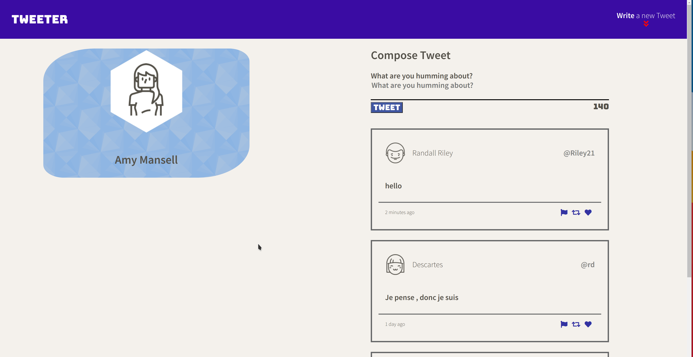
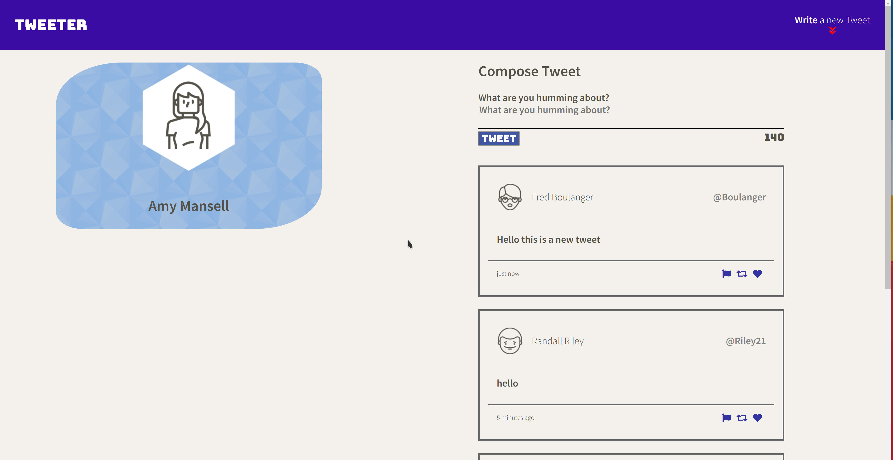

# Tweeter Project

Tweeter is a simple, single-page Twitter clone.

This repository is the starter code for the project: Students will fork and clone this repository, then build upon it to practice their HTML, CSS, JS, jQuery and AJAX front-end skills, and their Node, Express and MongoDB back-end skills.

## Features

- User can post tweet
- User can view tweets
- Time stamp showing relative time since the tweet
- Input validation
- Escaped intput to avoid injections
- Single page application

## Final Product

## Getting Started

1. Install dependencies using the `npm install` command.
1. Start the web server using the `npm run local` command. The app will be served at <http://localhost:8080/>.
1. Go to <http://localhost:8080/> in your browser.

## Dependencies

- Express
- Node 5.10.x or above
- Change
- Font Awesome
- md5
- timeago
